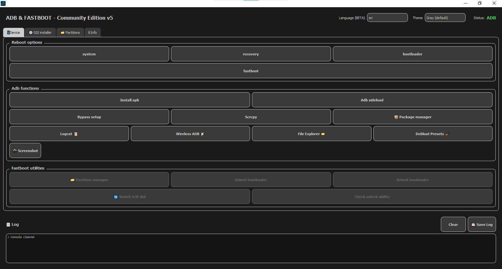
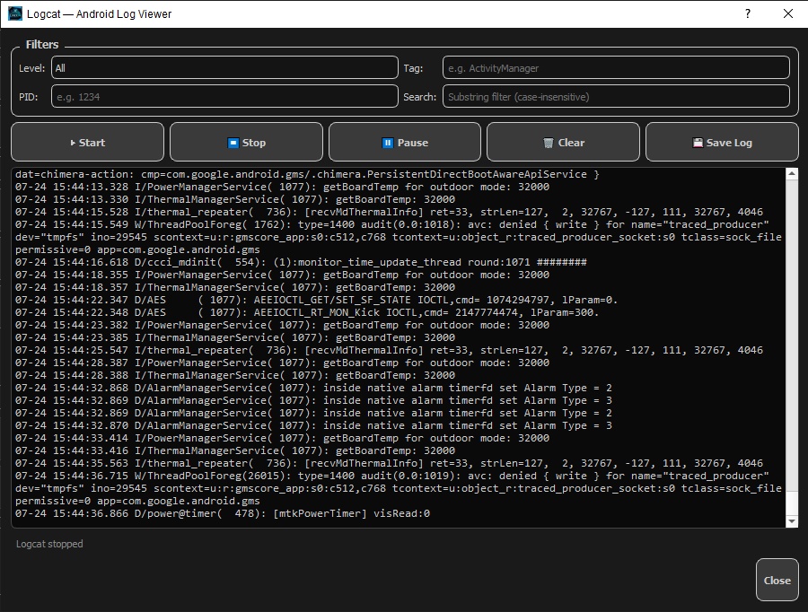
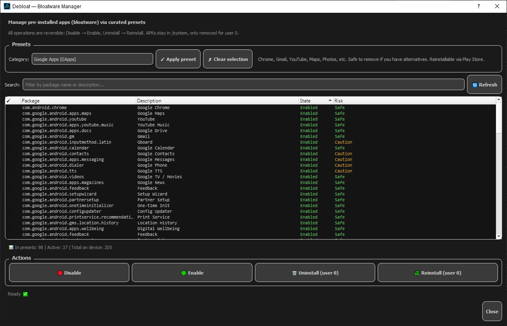
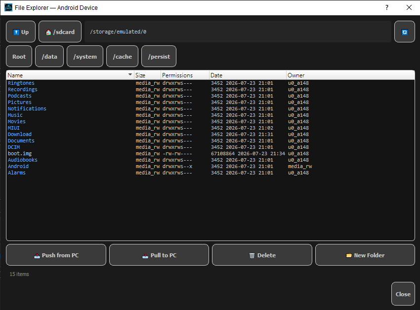
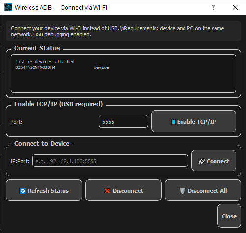
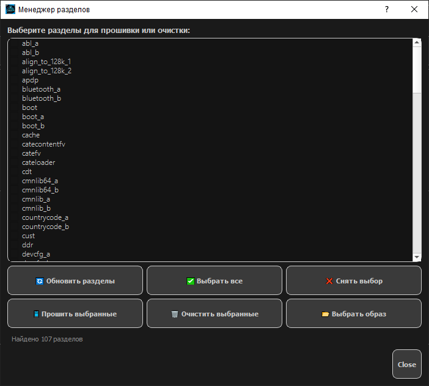

# ADB & Fastboot — Community Edition


**Бесплатный GUI для ADB и Fastboot с открытым кодом** — для тех, кто хочет удобство десктоп-утилиты Изначальная идея — [@LineXin](https://github.com/LineXin) [Telegram](https://t.me/LineXin1); Community Edition разрабатывает и поддерживает [@Kilib1k](https://github.com/kilib1k) [Telegram](https://t.me/Kilib1k).

**[Read in English](README.md)**

---

## 📸 Скриншоты

| Главное окно (вкладка Device) | Logcat | Debloat-пресеты |
|:---:|:---:|:---:|
|  |  |  |

| Проводник файлов | Беспроводной ADB | Менеджер разделов |
|:---:|:---:|:---:|
|  |  |  |

---

## ✨ Возможности

### ADB-функции
- **Установка APK** — выбрал `.apk`, нажал установить.
- **ADB sideload** — прошивка `.zip` через sideload в recovery.
- **Logcat** — живой поток с фильтрами (уровень/тег/PID/поиск), пауза/возобновление, сохранение в файл. Батчинг строк и `QPlainTextEdit` держат плавность даже на слабых CPU (Pentium-класса достаточно).
- **Проводник файлов** — навигация по `/sdcard` и дальше, push/pull/delete/mkdir с контекстным меню.
- **Беспроводной ADB** — включение TCP/IP-режима, подключение по `IP:port`, отключение.
- **Debloat-пресеты** — курированные списки для **Google Apps**, **Google Telemetry**, **Carrier/Partner**, **AOSP Optional**, **Samsung**, **Xiaomi/MIUI/HyperOS**. Все операции обратимы: Disable → Enable, Uninstall (user 0) → Reinstall. Каждый пакет помечен `Safe` или `Caution`.
- **Скриншот** — один клик, сохранение в PNG.
- **Bypass setup wizard** — для свежих GSI-прошивок.
- **Менеджер пакетов** — disable/enable/toggle для любого установленного пакета.

### Fastboot-утилиты
- **Менеджер разделов** — прошивка/стирание отдельных разделов с выбором образа.
- **Unlock/relock загрузчика** — с явными предупреждениями (Knox, вайп данных, риск брика).
- **Смена A/B слота** — определение активного слота и переключение.
- **Установщик GSI** — установка Generic System Images на A/B и A-only устройства с опцией `wipe data`.
- **Проверка возможности разблокировки** — читает `Device unlocked`, `Device critical unlocked`, `get_unlock_ability`.

### GUI / UX
- **8 тем оформления** — Gray (по умолчанию), Dark, Light, Green, Blue, Purple, Orange, Cyan.
- **RU / EN локализация** — переключение на лету, все надписи и диалоги.
- **Живой лог консоли** — каждая `adb`/`fastboot` команда и её вывод, сохранение в файл.
- **Авто-обновление** — проверяет GitHub Releases раз в сутки, показывает changelog, скачивает на месте.

---

## 📦 Требования

- **Windows** 7/10/11
- **Python 3.8+**
- **PyQt5**: `pip install PyQt5`.
- **ADB и Fastboot** — уже лежат в папке программы, либо скачай [последние platform-tools](https://developer.android.com/tools/releases/platform-tools).
- **USB-драйверы** для устройства (Windows часто требует [Google USB driver](https://developer.android.com/studio/run/win-usb) для ADB).
- **Отладка по USB** включена в меню разработчика.

---

## 🚀 Установка

### Вариант A — скачать скрипт
1. Зайди в [Releases](https://github.com/kilib1k/Adb_n_Fastboot/releases).
2. Скачай `AdbFastboot.py` и `localization.json` в одну папку.
3. Убедись, что в этой папке лежат `adb.exe`, `fastboot.exe`, `scrcpy.exe` (или они в `PATH`).
4. Запуск:
   ```cmd
   pip install PyQt5
   python AdbFastboot.py
   ```

### Вариант B — клонировать репо
```bash
git clone https://github.com/kilib1k/Adb_n_Fastboot.git
cd Adb_n_Fastboot
pip install PyQt5
python AdbFastboot.py
```

---

## 🧭 Быстрый старт

1. **Включи отладку по USB** на телефоне (Настройки → О телефоне → тапни 7 раз по Build → Меню разработчика → Отладка по USB).
2. **Подключи по USB**, прими RSA-запрос на телефоне.
3. **Запусти программу.** Статус должен смениться с `Offline` на `ADB`.
4. **Попробуй вкладку Device** — установить APK, открыть Logcat, или погулять по `/sdcard` через проводник.

---

## 🔧 Авто-обновления

Программа раз в сутки проверяет `https://raw.githubusercontent.com/kilib1k/Adb_n_Fastboot/main/update.json` и предлагает скачать новую версию. Старый скрипт сохраняется как `AdbFastboot.py.bak` перед заменой.

**Для форков/разработчиков:** поправь константу `UPDATE_MANIFEST_URL` в начале `AdbFastboot_v5.py` на свой `update.json`. См. `update.json` для схемы.

---

## 🩹 Решение проблем

| Симптом | Решение |
|---|---|
| `adb not found` в статусе | Положи `adb.exe` рядом со скриптом, или добавь в `PATH`. |
| Устройство `unauthorized` | Отзови разрешения отладки USB на телефоне, переподключи, прими RSA-запрос. |
| Статус застрял на `Offline` | Переустанови USB-драйверы; попробуй другой кабель/порт; выключи и включи отладку. |
| Logcat подлагивает | Снизь интервал flush в диалоге, закрой другие приложения. |
| PyQt5 не ставится на Python 3.13+ | Используй Python 3.12 LTS — wheel'ы PyQt5 отстают от свежих версий Python. |
| `pm disable-user` падает | На некоторых залоченных оператором телефонах `pm` ограничен. Используй `pm uninstall -k --user 0` (тоже обратимо). |

---

## 📜 Changelog

### v5.1 (2026-07-24) — Community Edition
- ➕ **Добавил цвета в LogCat**
- ➕ **Добавил поддержку Linux**
- ➖ **Удалил ненужный (Мусорный) код**

### v5.0 (2026-07-24) — Community Edition
- ➕ **Logcat** с живыми фильтрами, батчингом, сохранением в файл.
- ➕ **Беспроводной ADB** — диалог включения/подключения/отключения.
- ➕ **Проводник файлов** по `/sdcard` и не только.
- ➕ **Debloat-пресеты** — Google/Carrier/AOSP/Samsung/Xiaomi, обратимо.
- ➕ **Авто-обновление** через GitHub Releases.
- ➕ **Скриншот** одной кнопкой.
- 🐛 **Исправлен баг с регистром reboot-команд** — заглавные буквы в локализованных названиях кнопок (например `BootLoader`) приводили к ребуту в систему вместо bootloader. Команды теперь принудительно lowercase.
- ➕ RU/EN расширена на все диалоги.

---

## ⚠️ Disclaimer

**Модификация устройства через ADB и особенно Fastboot может превратить его в кирпич, стереть данные, или активировать аппаратные предохранители (например Knox на Samsung).** Авторы инструмента не несут ответственности за любой ущерб.

Особенно:
- **Разблокировка загрузчика стирает все пользовательские данные.**
- **Блокировка загрузчика на не-стоковой прошивке может brick'нуть некоторые устройства.**
- **Прошивка неправильного раздела (`boot`, `system`, `modem`, `xbl`) может потребовать EDL-восстановления или быть невосстановимой.**
- **Samsung** — блокировка активирует Knox counter навсегда, аннулируя гарантию.
- **Xiaomi** — `get_unlock_ability` требует 168 часов ожидания Mi Unlock; этот инструмент это обойти не может.

Всегда делай резервную копию. Всегда проверяй контрольные суммы образов перед прошивкой. Если сомневаешься — **не делай**.

---

## 👥 Авторы

- **Идея и первые исходники** — [@LineXin](https://github.com/LineXin) [Telegram](https://t.me/LineXin1).
- **Community Edition** — [@kilib1k](https://github.com/kilib1k) — Почти все фичи xD, багфиксы, поддержка.
- **PyQt5** — Riverbank Computing.

Название "Community Edition" отражает, что это открытое продолжение заброшенного проекта. Баги, Issue и PR приветствуются.

---

**⭐ Если инструмент сэкономил тебе время — поставь звезду репозиторию.**
